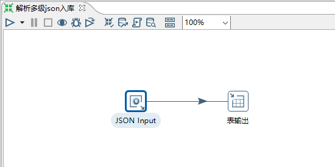
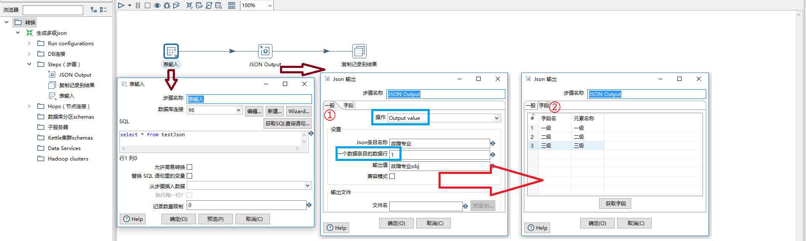
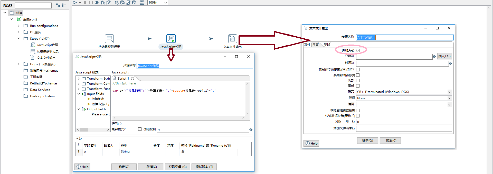
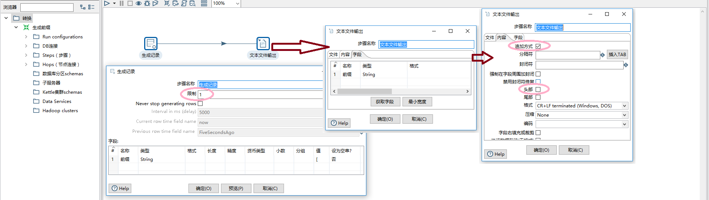
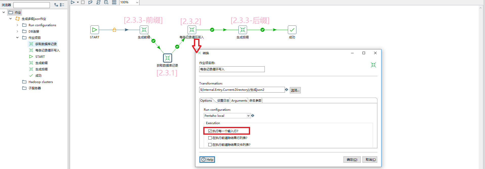

<!-- @import "[TOC]" {cmd="toc" depthFrom=1 depthTo=6 orderedList=false} -->

<!-- code_chunk_output -->

- [1. JSON文件多级解析](#1-json文件多级解析)
  - [1.1. 原JSON](#11-原json)
  - [1.2. 解析结果](#12-解析结果)
  - [1.3. KETTLE脚本](#13-kettle脚本)
- [2. JSON文件多级生成（数组）](#2-json文件多级生成数组)
  - [2.1. 原数据](#21-原数据)
  - [2.2. 准备-认识JSON输出](#22-准备-认识json输出)
  - [2.3. 开始作业](#23-开始作业)
    - [2.3.1. 数据读取和子层级JSON串生成](#231-数据读取和子层级json串生成)
    - [2.3.2. 对每一条数据生成目标JSON格式](#232-对每一条数据生成目标json格式)
    - [2.3.3. 前缀和后缀](#233-前缀和后缀)
    - [2.3.4. 组成一条生产线-作业](#234-组成一条生产线-作业)
  - [2.4. 最终输出结果展示](#24-最终输出结果展示)
- [3. 总结](#3-总结)

<!-- /code_chunk_output -->

---

## 1. JSON文件多级解析

### 1.1. 原JSON
先上原JSON（以三条数据为例），观察数据，是一个数组，其中"故障专业"包含多个子层级数据。

```json
[
  {
    "故障地点":"A地",
    "故障专业":{ "一级":"A", "二级":"B", "三级":"C", "四级":"C", "五级":"D"  }
  },{
    "故障地点":"B地",
    "故障专业":{ "一级":"D", "二级":"E", "三级":"F", "四级":"A", "五级":"C" }
  },{
    "故障地点":"C地",
    "故障专业":{ "一级":"A", "二级":"F", "三级":"F", "四级":"C", "五级":"C" }
  }
]
```

### 1.2. 解析结果
解析后数据如下表所示

|故障地点|一级|二级|三级|四级|五级|
|---|---|---|---|---|---|
|  A地 |   A|   B|   C|   C|   D|
|  B地 |   D|   E|   F|   A|   C|
|  C地 |   A|   F|   F|   C|   C|

### 1.3. KETTLE脚本
一个转换可以完成，新建一个`解析多级JSON入库.ktr`的转换。

* 使用组件
  * JSON Input
  * 表输出

* 转换内容

    转换也很简单，JSON输入数据，解析成各个字段入库即可。



* JSON Input

1. 选择JSON文件。


2. 定义读取的的字段，注意数组符合`[]`,读取的时候使用`$.[*].` ，例如`"故障地点"`，路径写作`$.[*].故障地点`


3. 点击预览，预览数据如图所示。


* 表输出：使用表输出控件将字段 `故障地点，一级，二级，三级，四级，五级` 入库到表即可。

---

## 2. JSON文件多级生成（数组）

和上文相比做一个逆过程，需要注意的是生成的数据是一个数组，并且包含多级数据。

### 2.1. 原数据

见上文[JSON文件多级解析-解析结果](#12-%e8%a7%a3%e6%9e%90%e7%bb%93%e6%9e%9c)

### 2.2. 准备-认识JSON输出

开始之前我们用一个例子了解一下KETTLE的`JSON Output` 组件。

 

* 测试数据-生成10条记录

 

* 对生成的数据JSONOutput

 

注意 `一个数据条目的数据行` 勾选 `0` ；`操作`步骤可选择输出文件，也可以选择 `Output value` ；对生成的数组条目加一个名称 ，如 `data`

 

* 最终生成的数据如下

```json
{
    "data":[
        {"A":"测试A","B":2.0,"C":"测试C","D":44.0},
        {"A":"测试A","B":2.0,"C":"测试C","D":44.0},
        {"A":"测试A","B":2.0,"C":"测试C","D":44.0},
        {"A":"测试A","B":2.0,"C":"测试C","D":44.0},
        {"A":"测试A","B":2.0,"C":"测试C","D":44.0},
        {"A":"测试A","B":2.0,"C":"测试C","D":44.0},
        {"A":"测试A","B":2.0,"C":"测试C","D":44.0},
        {"A":"测试A","B":2.0,"C":"测试C","D":44.0},
        {"A":"测试A","B":2.0,"C":"测试C","D":44.0},
        {"A":"测试A","B":2.0,"C":"测试C","D":44.0}
    ]
}
```

### 2.3. 开始作业
* 思路 

`JSON Output` 可生成对象（花括号包着），结合本例我们要生成数组，并且包含子层级，单单用 JSON输出 组件可能达不到要求；进而我们想的是可以用JAVAScript或者JAVA组件进行处理。这里我使用的方法是将目标文件内容前缀`[`,生成的一条一条对象数据，和后缀`]`依次写入目标文件。

* 注意项
  - 子JSON需要截掉条目名称，如`{"data":[{"A":"测试A","B":2.0,"C":"测试C","D":44.0}]}`,只需保留`[]`数据
  - 依次写入文件要求文件名称一致，且写入方式为追加

>现在我们开始吧。

#### 2.3.1. 数据读取和子层级JSON串生成
将子层级数据生成JSON串，注意输出数据会多一个条目名称。各个步骤如下图所示：



预览数据如下：

|故障地点|故障专业obj|
|---|---|
|  A地 |{"故障专业":{ "一级":"A", "二级":"B", "三级":"C", "四级":"C", "五级":"D"  }}|
|  B地 |{"故障专业":{ "一级":"D", "二级":"E", "三级":"F", "四级":"A", "五级":"C" }}|
|  C地 |{"故障专业":{ "一级":"A", "二级":"F", "三级":"F", "四级":"C", "五级":"C" }}|

#### 2.3.2. 对每一条数据生成目标JSON格式
利用JS，我们截取子层级条目名称，并将每一条数据拼接层所需要的对象`{}`格式，将该条数据以追加的方式输出到文件中。



#### 2.3.3. 前缀和后缀
生成一行前缀 `[` 追加到文件，如下图所示。后缀亦然。

> 文本文件输出追加方式，头部不生效



#### 2.3.4. 组成一条生产线-作业
现在我们把前几步生成的组件 组成一条生产线吧。
1. START 开始
2. 生成前缀`[`
3. 获取数据记录，顺便把子层级json生成
4. 对上一步生成的每一条记录循环生成目标格式
5. 生成后缀`]`
6. 结束



### 2.4. 最终输出结果展示

```json
[
  {
    "故障地点":"A地",
    "故障专业":{ "一级":"A", "二级":"B", "三级":"C", "四级":"C", "五级":"D"  }
  },{
    "故障地点":"B地",
    "故障专业":{ "一级":"D", "二级":"E", "三级":"F", "四级":"A", "五级":"C" }
  },{
    "故障地点":"C地",
    "故障专业":{ "一级":"A", "二级":"F", "三级":"F", "四级":"C", "五级":"C" }
  },
]
```

## 3. 总结
我们在实际工作中经常遇到一些特殊的要求，在使用KETTLE的时候就需要我们对常规用法加以改造以达到生产工作的要求。
