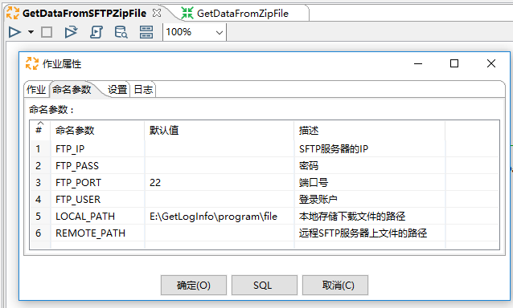
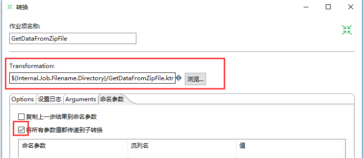
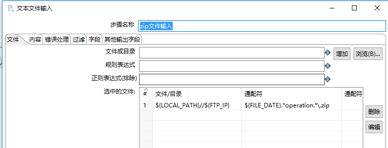
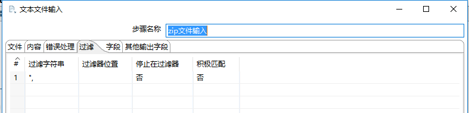
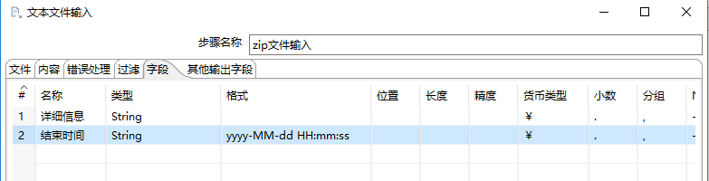
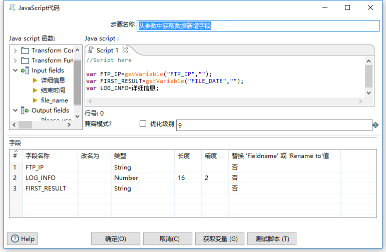
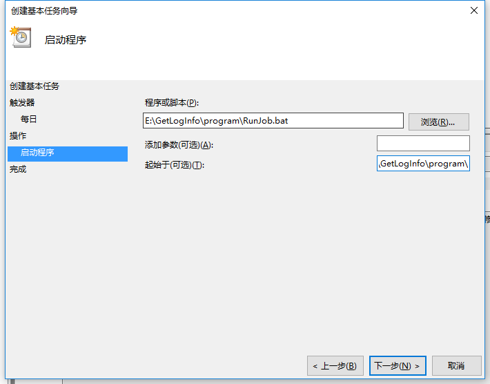
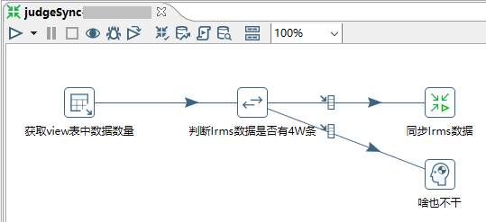
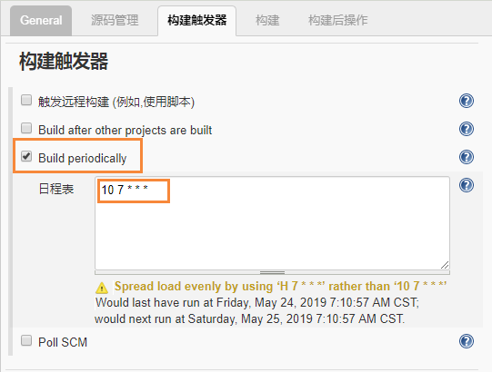

- [8. 完整的开发实例](#8-%E5%AE%8C%E6%95%B4%E7%9A%84%E5%BC%80%E5%8F%91%E5%AE%9E%E4%BE%8B)
  - [8.1. 一次基于命名参数和任务计划定时的Windows开发案例](#81-%E4%B8%80%E6%AC%A1%E5%9F%BA%E4%BA%8E%E5%91%BD%E5%90%8D%E5%8F%82%E6%95%B0%E5%92%8C%E4%BB%BB%E5%8A%A1%E8%AE%A1%E5%88%92%E5%AE%9A%E6%97%B6%E7%9A%84windows%E5%BC%80%E5%8F%91%E6%A1%88%E4%BE%8B)
    - [8.1.1. 前言](#811-%E5%89%8D%E8%A8%80)
      - [8.1.1.1. 环境](#8111-%E7%8E%AF%E5%A2%83)
      - [8.1.1.2. 业务说明](#8112-%E4%B8%9A%E5%8A%A1%E8%AF%B4%E6%98%8E)
    - [8.1.2. 设计](#812-%E8%AE%BE%E8%AE%A1)
      - [8.1.2.1. 流程组件设计](#8121-%E6%B5%81%E7%A8%8B%E7%BB%84%E4%BB%B6%E8%AE%BE%E8%AE%A1)
      - [8.1.2.2. 关键点设计](#8122-%E5%85%B3%E9%94%AE%E7%82%B9%E8%AE%BE%E8%AE%A1)
      - [8.1.2.3. 即将用到的组件](#8123-%E5%8D%B3%E5%B0%86%E7%94%A8%E5%88%B0%E7%9A%84%E7%BB%84%E4%BB%B6)
    - [8.1.3. 开发](#813-%E5%BC%80%E5%8F%91)
      - [8.1.3.1. 数据结构](#8131-%E6%95%B0%E6%8D%AE%E7%BB%93%E6%9E%84)
      - [8.1.3.2. 定义文件](#8132-%E5%AE%9A%E4%B9%89%E6%96%87%E4%BB%B6)
      - [8.1.3.3. 定义参数](#8133-%E5%AE%9A%E4%B9%89%E5%8F%82%E6%95%B0)
      - [8.1.3.4. 作业流程](#8134-%E4%BD%9C%E4%B8%9A%E6%B5%81%E7%A8%8B)
        - [8.1.3.4.1. 作业设置](#81341-%E4%BD%9C%E4%B8%9A%E8%AE%BE%E7%BD%AE)
        - [8.1.3.4.2. START](#81342-start)
        - [8.1.3.4.3. SFTP下载](#81343-sftp%E4%B8%8B%E8%BD%BD)
        - [8.1.3.4.4. deleteBeforeInsert](#81344-deletebeforeinsert)
        - [8.1.3.4.5. GetDataFromZipFile](#81345-getdatafromzipfile)
      - [8.1.3.5. 子转换](#8135-%E5%AD%90%E8%BD%AC%E6%8D%A2)
        - [8.1.3.5.1. 转换](#81351-%E8%BD%AC%E6%8D%A2)
        - [8.1.3.5.2. zip文件输入](#81352-zip%E6%96%87%E4%BB%B6%E8%BE%93%E5%85%A5)
        - [8.1.3.5.3. 数据处理](#81353-%E6%95%B0%E6%8D%AE%E5%A4%84%E7%90%86)
        - [8.1.3.5.4. 表输出](#81354-%E8%A1%A8%E8%BE%93%E5%87%BA)
    - [8.1.4. 调度运行](#814-%E8%B0%83%E5%BA%A6%E8%BF%90%E8%A1%8C)
      - [8.1.4.1. 编写脚本](#8141-%E7%BC%96%E5%86%99%E8%84%9A%E6%9C%AC)
      - [8.1.4.2. 任务计划](#8142-%E4%BB%BB%E5%8A%A1%E8%AE%A1%E5%88%92)
  - [8.2. 一次基于资源库和jenkin调度的Linux开发案例](#82-%E4%B8%80%E6%AC%A1%E5%9F%BA%E4%BA%8E%E8%B5%84%E6%BA%90%E5%BA%93%E5%92%8Cjenkin%E8%B0%83%E5%BA%A6%E7%9A%84linux%E5%BC%80%E5%8F%91%E6%A1%88%E4%BE%8B)
    - [8.2.1. 业务说明](#821-%E4%B8%9A%E5%8A%A1%E8%AF%B4%E6%98%8E)
    - [8.2.2. 准备工作](#822-%E5%87%86%E5%A4%87%E5%B7%A5%E4%BD%9C)
      - [8.2.2.1. 开发环境](#8221-%E5%BC%80%E5%8F%91%E7%8E%AF%E5%A2%83)
      - [8.2.2.2. 生产环境Kettle](#8222-%E7%94%9F%E4%BA%A7%E7%8E%AF%E5%A2%83kettle)
      - [8.2.2.3. 生产环境Jenkins](#8223-%E7%94%9F%E4%BA%A7%E7%8E%AF%E5%A2%83jenkins)
    - [8.2.3. 作业流程](#823-%E4%BD%9C%E4%B8%9A%E6%B5%81%E7%A8%8B)
      - [8.2.3.1. 涉及组件](#8231-%E6%B6%89%E5%8F%8A%E7%BB%84%E4%BB%B6)
      - [8.2.3.2. 作业](#8232-%E4%BD%9C%E4%B8%9A)
      - [8.2.3.3. 子转换](#8233-%E5%AD%90%E8%BD%AC%E6%8D%A2)
        - [8.2.3.3.1. 获取判断条件](#82331-%E8%8E%B7%E5%8F%96%E5%88%A4%E6%96%AD%E6%9D%A1%E4%BB%B6)
        - [8.2.3.3.2. 是否具备同步条件](#82332-%E6%98%AF%E5%90%A6%E5%85%B7%E5%A4%87%E5%90%8C%E6%AD%A5%E6%9D%A1%E4%BB%B6)
        - [8.2.3.3.3. 同步Irms数据](#82333-%E5%90%8C%E6%AD%A5irms%E6%95%B0%E6%8D%AE)
      - [8.2.3.4. 子子转换](#8234-%E5%AD%90%E5%AD%90%E8%BD%AC%E6%8D%A2)
        - [8.2.3.4.1. targetTable](#82341-targettable)
        - [8.2.3.4.2. sourceTable](#82342-sourcetable)
        - [8.2.3.4.3. 调整IRMS数据的类型](#82343-%E8%B0%83%E6%95%B4irms%E6%95%B0%E6%8D%AE%E7%9A%84%E7%B1%BB%E5%9E%8B)
        - [8.2.3.4.4. 根据关键字比较记录](#82344-%E6%A0%B9%E6%8D%AE%E5%85%B3%E9%94%AE%E5%AD%97%E6%AF%94%E8%BE%83%E8%AE%B0%E5%BD%95)
        - [8.2.3.4.5. Switch/Case](#82345-switchcase)
    - [8.2.4. 迁移至生产环境](#824-%E8%BF%81%E7%A7%BB%E8%87%B3%E7%94%9F%E4%BA%A7%E7%8E%AF%E5%A2%83)
    - [8.2.5. 生产调度运行](#825-%E7%94%9F%E4%BA%A7%E8%B0%83%E5%BA%A6%E8%BF%90%E8%A1%8C)


## 8. 完整的开发实例
从部署到维护，分别给出Linux和Windows平台的两个例子，仅供参考。
### 8.1. 一次基于命名参数和任务计划定时的Windows开发案例
#### 8.1.1. 前言
##### 8.1.1.1. 环境
本机win10 64位 + Informix

##### 8.1.1.2. 业务说明
周期性每天从SFTP取日志文件解析入库。其中，SFTP服务器多个，采集的文件和最终解析都一致。
#### 8.1.2. 设计
##### 8.1.2.1. 流程组件设计
基本流程很简单，我们分两步：
1. 获取文件：可以在作业中使用SFTP组件 
2. 解析文件入库：可以在转换中使用文本文件输入和表输出组件

我们设计一个子转换，命名为 **GetDataFromZipFile** ，这个转换主要是读取下载的文件，解析入库；我们设计一个作业，命名为 **GetDataFromSFTPZipFile** ，下载文件，调用自转换解析入库。
##### 8.1.2.2. 关键点设计
有几个点需要注意：
1. 流程需要支持数据补采：针对下载的文件已存在就覆盖，针对入库的数据，入库前需要先删除
2. 下载的文件包含日期关键因素，如文件名 yyyyMMdd_xxxxxx.zip
3. 需要区别是从哪个SFTP服务器获取的数据，我们要把服务器IP也一并入库
4. 周期性的日期也需要设计在入库表中
5. 不同服务器的信息作为参数传递

##### 8.1.2.3. 即将用到的组件
* 作业
    - 通用 - START
    - 文件传输 - SFTP下载
    - 脚本 - SQL
    - 通用 - 转换
* 转换
    - 输入 - 文本文件输入
    - 脚本 - JavaScript代码
    - 输出 - 表输出

#### 8.1.3. 开发

##### 8.1.3.1. 数据结构
对日志信息这里简单定义为一个字段log_info
```sql
create table operlog_cszywg_new(
    first_result int, --周期时间 yyyyMMdd
    log_info lvarchar(1000), --日志信息
    ftp_ip varchar(20), --服务器IP
    file_name varchar(255), --文件名称
    insert_time datetime year to second default current year to second --默认插入时间为当前时间
);
```

##### 8.1.3.2. 定义文件
- 新建文件夹 `program` 作为主文件夹
- 新建 `log` 文件夹存储日志
- 新建 `file` 文件夹存储下载的文件
- 在`Spoon`页面新增转换保存为 `GetDataFromZipFile.ktr`
- 在`Spoon`页面新增作业保存为 `GetDataFromSFTPZipFile.kjb`

最终目录如下：


##### 8.1.3.3. 定义参数
定义以下参数：
|参数	|默认值	|描述|
|-|-|-|
|FILE_DATE|	20181127|数据日期，也是下载文件的关键信息|
|FTP_IP		||SFTP服务器的IP|
|FTP_PASS		||密码|
|FTP_PORT	|22	|端口号|
|FTP_USER		||登录账户|
|LOCAL_PATH	|E:\GetLogInfo\program\file|本地存储下载文件的路径	|
|REMOTE_PATH	||远程SFTP服务器上文件的路径|


##### 8.1.3.4. 作业流程
###### 8.1.3.4.1. 作业设置
作业相当于一条流水线，我们设计如图所示：


在画布上 **右键**-**作业设置** 打开作业属性，点击 **命名参数**，将参数预设。



###### 8.1.3.4.2. START
**START 开始**是入口。

###### 8.1.3.4.3. SFTP下载

`${ParamName}` 的方式访问参数。


远程服务器的文件存在对应文件夹下面对应的日期目录下，同时用正则去获取匹配的文件（同一个日期只有一个匹配的文件）。特别注意的是勾选 **创建目标文件** 。
- [x] 创建目标文件


###### 8.1.3.4.4. deleteBeforeInsert
要注意勾选 **使用变量替换**。
- [x] 使用变量替换


###### 8.1.3.4.5. GetDataFromZipFile
转换的目录写相对目录：`${Internal.Job.Filename.Directory}/GetDataFromZipFile.ktr`,即 作业所在目录下该转换；勾选 **将所有参数值都传递到子转换。**
- [x] 将所有参数值都传递到子转换。




##### 8.1.3.5. 子转换
###### 8.1.3.5.1. 转换
我们这个作业相当于一个超级兵，他能获取下载的文件，并对数据处理入库。


###### 8.1.3.5.2. zip文件输入
* 文件

注意 **文件/目录** 填写的是本地下载的文件目录。



* 内容
    - 文件类型：`CSV`表示分隔符文件，`Fixed`表示固定长度字段文件
    - 分隔符：按实际情况填写
    - 头部数据：表头
    - 是否压缩文件：本例zip压缩
    - 格式：根据实际情况选择（DOS,Unix,mixed)
    - 编码方式：根据实际情况选择


* 错误处理：可以过滤不要的数据。



* 字段：根据分隔符分隔的字段，可以对字段类型进行初步处理



* 其他输出字段：本文需要的文件名称


###### 8.1.3.5.3. 数据处理
FTP_IP和日期均为父作业传过来的，我们用 JavaScript代码组件获取这两个数据，并给每一行数据新增两个相应字段。顺便，我们把 上一步输入的 **详细信息** 赋值给 `LOG_INFO` 和数据库字段对应。



###### 8.1.3.5.4. 表输出
由于上一步输入的数据各字段和表字段一致，我们不需要指定数据库字段。批量提交可以更快更稳定的输出数据。
- [ ] 指定数据库字段
- [X] 使用批量插入


#### 8.1.4. 调度运行

##### 8.1.4.1. 编写脚本
在E:\GetLogInfo\program新增脚本RunJob.bat
```bat
@echo off
setlocal enabledelayedexpansion 
for /f "tokens=2 delims==" %%a in ('C:\Windows\System32\wbem\wmic path win32_operatingsystem get LocalDateTime /value') do (
  set t=%%a
)
rem ======================SetVAR====================================
rem 执行日期
set yyyyMMdd=%t:~0,4%%t:~4,2%%t:~6,2%
rem 定义日志文件
set LogFile=E:\GetLogInfo\program\log\%yyyyMMdd%\
rem 执行的脚本
set JobFile=E:\GetLogInfo\program\GetDataFromSFTPZipFile.kjb
set KitB=$KETTLE_HOME/kitchen.bat

rem ====固定输入参数====
set ftpIp=192.168.10.8
set ftpPort=2121
set ftpUser=ftpTest
set ftpPwd=W22223
set localPath=E:\\GetLogInfo\\program\\file
set remotePath=/
rem ===================

rem ======================RunJob===================================
rem job
%KitB% -param:"FILE_DATE=%yyyyMMdd%" -param:"FTP_IP=%ftpIp%" -param:"FTP_PASS=%ftpPort%" -param:"FTP_PORT=%ftpUser%" -param:"ftpPwd=%yyyyMMdd%" -param:"LOCAL_PATH=%localPath%" -param:"REMOTE_PATH=%remotePath%" -file %JobFile% >> %LogFile%.log

rem pause 运行脚本后暂停窗口
```
* 在spoon页面点击运行后输入命名参数值进行测试
* 或者双击脚本进行测试

##### 8.1.4.2. 任务计划

1. 管理工具 - 任务计划程序 
2. 新建文件夹GetLogInfo
3. 在文件夹下创建基本任务，根据向导配置
  
注意启动程序步骤脚本为运行脚本，“起始于(可选)” 输入脚本所在路径。




### 8.2. 一次基于资源库和jenkin调度的Linux开发案例
#### 8.2.1. 业务说明
从A数据库(oracle库，代号irms)增量更新数据到B数据库(informix，无代号)。
* 如果irms数据不足4W，informix就不要它同步的数据了
* irms库表和informix对应的表字段名字不完全相同但是需要更新的字段能一一对应
* 同步的表有关键字的可关联
* 不涉及时间，两库中的涉及表都是现网表，历史数据有其他快照处理


#### 8.2.2. 准备工作
##### 8.2.2.1. 开发环境
部署kettle，新增文件类型的资源库，新增目标和源数据库的数据链接
  - Windows Win10+64bit  
  - Kettle: Version7.1
  - jdk: java version "1.8.0_151"
1. 安装jdk
2. 拷贝下载解压后的文件夹pdi-ce-7.1.0.0-12到本机
3. 配置KETTLE_HOME和JAVA_HOME
4. 双击spoon.bat打开可视化界面
5. 右上角资源库管理新建一个文件夹类型的资源库，命名为test,默认用户密码均为admin;次数可以看到资源库文件夹：`Repository\test`
6. 工具箱-资源库-探索资源库-连接，右上角+ 新增数据库两个连接：A. oracle B. informx

##### 8.2.2.2. 生产环境Kettle
部署Kettle,配置JAVA_HOME和KETTLE_HOME
  * OS: CentOS release 6.5 (Final)
  * jdk: java version "1.8.0_171"
  * Kettle: 7.1.0.0-12

1. 安装jdk
2. 拷贝下载解压后的文件夹pdi-ce-7.1.0.0-12到Linux机器`/opt/test/pdi`目录下
3. 配置环境变量，在`~/.cshrc`文件中新增如下片段，并使之生效
```shell
########### Set Kettle&Java env ############
setenv KETTLE_HOME /opt/test/pdi/pdi-ce-7.1.0.0-12/data-integration
setenv JAVA_HOME /usr/java/jdk1.8.0_171-amd64
```
##### 8.2.2.3. 生产环境Jenkins
* 拷贝官网下载的jenkins.war 到Linux系统目录下：`/opt/test/jenkins/jenkins.war`
* 执行一下脚本安装：(可根据实际情况给端口)
```java
java ­jar jenkins.war ­­httpPort 10001 &
```
* 安装完毕，访问`http://IP:10001` ，进行账号注册
* 登录页面如下：


#### 8.2.3. 作业流程
设计三个文件：
1. finally-Sync.kjb 主作业：挑起流程的大梁
2. judgeSync.ktr 子转换：判断源数据库irms该表数据是否满4W
3. syncFromIrms.ktr 子子转换：同步
##### 8.2.3.1. 涉及组件
* finally-Sync.kjb
  - 通用-START
  - 通用-转换
  - 通用-成功
  - 通用-DUMMY(啥也不干)
* judgeSync.ktr
  - 输入-表输入
  - 流程-Switch / Case
  - 流程-空操作(什么也不做)
  - 流程-Transformation Executor
* syncFromIrms.ktr
  * 输入- 表输入
  * 选择-字段选择
  * 连接-合并记录
  * 流程-Switch / Case
  * 流程-空操作(什么也不做)
  * 输出-更新
  * 输出-表输出
  * 输出-删除

##### 8.2.3.2. 作业
finally-Sync.kjb，START开始流程第二步进入子转换judgeSync。


##### 8.2.3.3. 子转换

judgeSync.ktr 从源库获取源表数据条数，判断是否符合同步条件。


###### 8.2.3.3.1. 获取判断条件
获取view表中数据数量：表输入控件获取count和40000比一个确切数值，如大于4W返回1，否则返回0；SQL如下：
```sql
select (case when count(1)>40000 then 1 else 0 end) as cn
from test_view
```
###### 8.2.3.3.2. 是否具备同步条件
判断Irms数据是否有4W条：判断上一步传入的CN，类型是Number,如果是1（大于4W）则满足同步条件，否则啥也不干。


###### 8.2.3.3.3. 同步Irms数据
满足同步条件后进入同目录下的子子转换


##### 8.2.3.4. 子子转换
syncFromIrms.ktr 获取目标表（targetTable）和源表（sourceTable）数据进行比较更新。


###### 8.2.3.4.1. targetTable
从目标库（informix）的目标表查询数据,注意按照关键字进行排序

> 注意：**比较前必须要排序**
```sql
select lac,ci,longitude,latitude
--......
from test_cell
order by 1,2
```
###### 8.2.3.4.2. sourceTable
从源库irms（oracle）的源表查询数据：可以在这里将字段别名和目标库要同步字段一一对应（也可以在下一步选择/改名值对字段进行改名）；注意按照关键字进行排序（和目标库排序顺序一致）


```sql
select irms_lac as lac ,irms_ci as ci,irms_long as longitude,irms_lat as latitude
--......
from test_view
order by irms_lac,irms_ci
```
###### 8.2.3.4.3. 调整IRMS数据的类型
这个步骤可以做两件事，我们做了其中一件：对字段类型进行统一（oracle-->informix）；另一件事情是字段名字的统一，我们在上一步sql里别名处理了。类型处理如：


  1. 类型转换如：oracle 不存在integer类型，informix 不存在Bignumber，对sourceTable存储为Bignumber的字段按实际业务转换成number或者Integer；其他字段按需处理；
  2. 我们对上个步骤sourceTable 和当前步骤调整IRMS数据类型步骤右键-查看输出的字段，比较如下图所示：


###### 8.2.3.4.4. 根据关键字比较记录
通过关键字，对目标数据和源数据进行比较，比较结果标志字段命名为：flagfield；左边是匹配的关键字，关键字段两个数据源都有；右边是数据字段，需要从旧数据源更新到新数据源


###### 8.2.3.4.5. Switch/Case
对上一步骤的标志字段flagfield进行比较，比较类型为string
- new 旧数据源有，新数据源没有，进行插入处理；
- changed 旧数据源和新数据源都有，但是更新字段内容不同，进行更新处理；
- deleted 旧数据源有，新数据源没有，进行删除处理；
- identical 旧数据源和新数据源都有，且更新字段一致，不作任何处理。


本机测试通过后咱们就可以迁移至生产环境了~

#### 8.2.4. 迁移至生产环境
* 将本地Repository文件夹拷贝到Linux机器`/opt/test/pdi`目录下，咱们开发的作业和转换都在`Repository/test`文件夹下了
* 将本地`~\pdi-ce-7.1.0.0-12\data-integration\.kettle\repositories.xml`拷贝到Lunux对应目录下，修改其中对应的Repository路径，注意不要有变动（包括格式）
```xml
<?xml version="1.0" encoding="UTF-8"?>
<repositories>
  <repository>    <id>KettleFileRepository</id>
    <name>test</name>
    <description>File repository</description>
    <is_default>false</is_default>
    <base_directory>/opt/test/pdi/Repository/test</base_directory>
    <read_only>N</read_only>
    <hides_hidden_files>N</hides_hidden_files>
  </repository>  </repositories>
```

#### 8.2.5. 生产调度运行
* 访问`http://IP:10001`，登录操作页面
* 左上角新建，新建一个item


* 输入描述，勾选关闭构建，表示如果新任务启动旧任务仍未结束，则关闭旧任务；可按需勾选
- [x] 关闭构建


* 构建触发器，周期运行，勾选Build periodically；写入日程表，同crontab，下发会提示本次和下次的执行时间
- [x] Build periodically


* 选择Execute shell 构建，在Command窗口写入脚本
```sh
#!/bin/sh -l

exec_date=`date +%Y%m%d`
exec_job=test/finally-Sync

sh $KETTLE_HOME/kitchen.sh -rep=test -user=admin -pass=admin -job=$exec_job
```


* 保存该构建，可立即构建
* 一些常用图例的说明

|图例|说明|
|-|-|
| |项目从未构建，或者被禁用|
||第一次构建中|
||上一个构建成功|
||上一个构建成功。一个新的构建正在进行中|
||上一个构建彻底失败。|
||上一个构建彻底失败。新的构建进行中。|

* 日志查看：点击构建名称进入该构建面板，左下角包含所有构建历史，点击任意一次构建历史进入，然后点击左上角`Console Output`可查看控制台输出日志